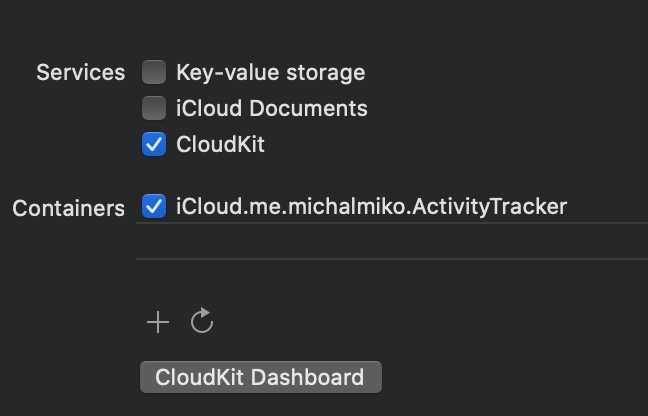
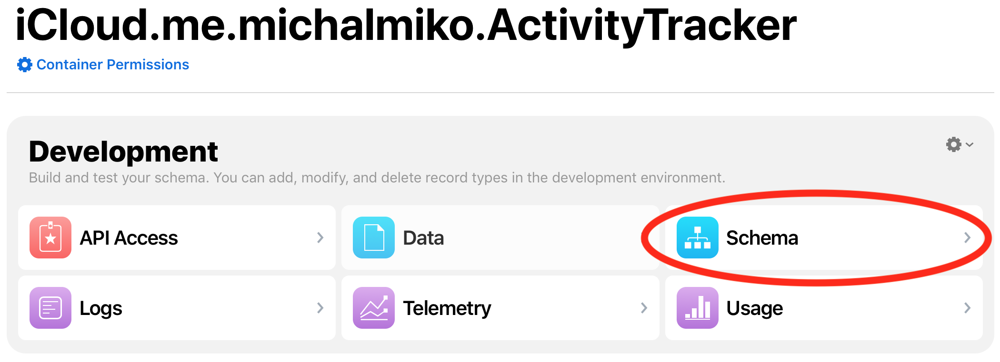
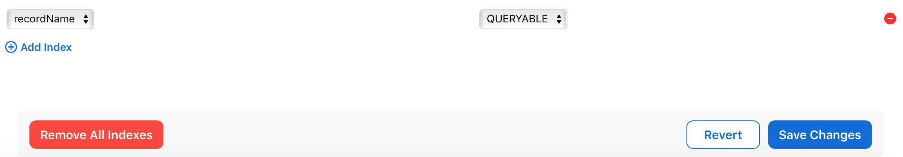

#SportActivity tracker

###Table of content
 * [**Used technologies, frameworks etc.**](#Used)
 * [**How to build**](#Build)

## Used technologies, frameworks etc.

Minimum target is iOS13. Tested only on iOS14. 
Used architecture is VIP Architecture based on Clean Swift. 
For this app, it is a little bit overkill. For small App I would prefer MVVM with a few managers. 

For local storage is used CoreData. 
For remote storage is used CloudKit.
I want to learn something new. So I chose frameworks I am the least experienced.

Possible improvements or what would I do if this app would be real:

* Crashylitics, Analytics (Firebase etc.)
* CI/CD Deployment (Fastlane etc.)
* Full sets of tests (just example test is implemented right now)
* Some localization scripts (loading texts from excel sheets accssible for translators etc.)
* Better handling error (Custom message instead just localized description)
* full fledget experience (delete, update of activity, showing detail, nice adress picker and saving GPS location instead of string, record activity with some tracking, connect to Healtkit etc. 
* Make storage managers reusable and universal throught generics for easier use through different apps. 
* Not all cases are handled. for example missing some loader for indication fetching remote data, some no data labels for collection view, better success screen, some info about necessary authentification via icloud etc.

## How to build

For simpler build I am not using any pods, ruby scripts etc. 
All used frameworks is Apple native.

For remote storage is used AppleCloudkit.
It is necessary to be logged in with iCloud account. 

After build you will probably see error like this:

>recordName is not Queryable

You need to check:

* CloudKit container was created in Signing&Capabilities tap 
  (and right development team is set. 
  
  
  

* go to  CloudkitDashboard, select app container, Schema
	

* Edit indexes -> Add indexes -> set "recordName" to QueryAble -> Save 

	

* everything should be working now

There is example of app UITests:

